# QMK ADB to USB Converter
A custom ADB to USB Converter with an OLED screen, made with QMK, for my vintage [Apple Standard Keyboard](https://deskthority.net/wiki/Apple_Standard_Keyboard)

Special thanks to [tzarc](https://github.com/tzarc) for making the firmware of the converter & [ronangaillard](https://github.com/ronangaillard) for making the PCB.

## About the project
This all started when I wanted to try out vintage mechanical keyboards and found an Apple Standard Keyboard on a second hand site for cheap. Documentation & resources about converters that I found was very spread out or old so I decided to centralize my findings on here for if other people would try the same.

## Goals
- Being able to connect the keyboard with USB, preferably USB-C
- Fully programmable with multiple layers with QMK
- Display info about the current layer and capslock & numlock on an OLED screen

## Firmware
Using QMK was a must for me to have the keyboard be easily programmable (and already having a little experience with it helped too). Luckily, someone else also made [a converter](https://github.com/qmk/qmk_firmware/tree/master/keyboards/converter/adb_usb) on the QMK repository that I needed to customize for use with an OLED screen and the Apple Standard Keyboard (it was made mainly for the Apple Extended Keyboard).

### Wiring
For wiring the ADB socket to the Arduino, only 3 wires are necessary for conversion (the power SW pin is not used): 


      ,--_--.
     / o4 3o \      1: DATA
    | o2   1o |     2: Power SW
     -  ===  -      3: VCC
      `-___-'       4: GND


    Keyboard       Converter
                   ,------.
    VCC-----+------|5V    |
            |      |      |
           [R]     |      |
            |      |      |
    DATA----+------|PD0   |
                   |      |
    GND------------|GND   |
                   `------'
    R: 1K Ohm resistor

I'll be using an Arduino Pro Micro for this, where pin PD0 is pin 3 (D0 on the image).


Sadly, this pin is also for I2C communication (which I will need for the OLED screen), but luckily the pin for the converter can be customized by changing the value for `ADB_DATA_BIT` in `config.h` where 0 stands for pin PD0 so changing it to 2 will make it use pin PD2 (pin 0 on the Pro Micro).

For the OLED screen I'll be using pins 2 (SDA) and 3 (SCL) for the I2C communication. This also requires adding a few things in the firmware files:
- `rules.mk`: Add `OLED_ENABLE = yes`
- `config.h`: If any changes need to be made to QMK's default OLED configuration, they should be made here. I added `#define OLED_TIMEOUT 0` to have the screen always on
- `keymap.c`: In your keymap file you'll need to add the necessary functions to display what you want on the screen.
    ```c
    #ifdef OLED_ENABLE

    bool oled_task_user(void) {
        // Host Keyboard Layer Status
        // oled_write_P(PSTR("Layer: "), false);

        switch (get_highest_layer(layer_state)) {
            case 0:
                oled_write_ln_P(PSTR("DEFAULT\n"), false);
                break;
            case 1:
                oled_write_ln_P(PSTR("FUNCTION\n"), false);
                break;
            default:
                // Or use the write_ln shortcut over adding '\n' to the end of your string
                oled_write_ln_P(PSTR("Undefined"), false);
        }

        // Host Keyboard LED Status
        led_t led_state = host_keyboard_led_state();
        oled_write_P(led_state.num_lock ? PSTR("NUM ") : PSTR("    "), false);
        oled_write_P(led_state.caps_lock ? PSTR("CAP ") : PSTR("    "), false);
        oled_write_P(led_state.scroll_lock ? PSTR("SCR ") : PSTR("    "), false);
        
        return false;
    }

    oled_rotation_t oled_init_user(oled_rotation_t rotation) {
        return OLED_ROTATION_180;  // flips the display 180 degrees if offhand
    }

    #endif
    ```

### Layers
Since the Apple Standard Keyboard doesn't have a function row and the extra buttons of a full sized keyboard (home, end, pg up/down, ...) that I use while developing, I wanted to have atleast 2 layers.

One with the normal keys shown on the keycaps
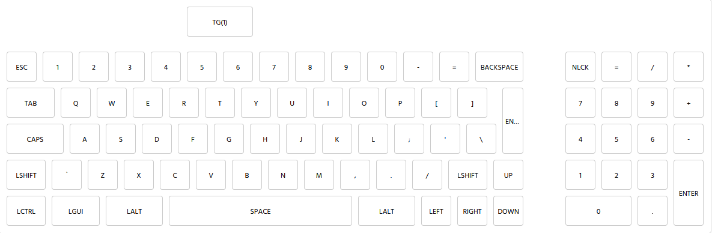

And one with all the special keys
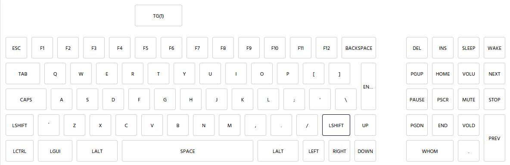

### Building the firmware
In the [QMK docs](https://docs.qmk.fm) you can find plenty of information on what you'll need to be able to build the firmware and how to flash it, but in short you'll need:

- `QMK MSYS`: For building the firmware. 
    - Use `qmk setup` for setting up the qmk_firmware folder where all keyboards, keymaps & logic is contained. By default it's installed under your user folder.
    - For the converter code, you'll find it at `keyboards/converter/adb_usb` (and replace the files with those from this repo if you want to use my code)
    - I've used the following command to build the firmware: `qmk compile -kb converter/adb_usb/rev1 -km default`
- `QMK Toolbox`: For flashing the firmware onto the Arduino
- Some IDE or text editor for customizing the firmware, I've used `Visual Studio Code`

## Converter
I couldn't just leave an Arduino, a port, a resistors and some wires dangling between my keyboard and my pc (even though that's what I did for a while), so I went looking into making a PCB design. 

### PCB
Luckily, once again, [somebody else](https://github.com/ronangaillard/adb2usb) made *almost* what I needed. A PCB for the Arduino Pro Micro and the ADB port, but without the OLED screen connection.

With some slight modifications to the wiring for using a different pin for the conversion and adding the connections for the OLED screen, it looks like this:
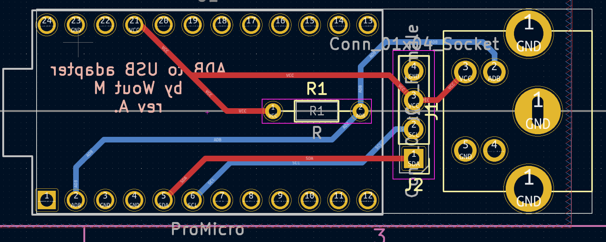

### Parts
| Part name                                                                                                 | Price  |
| ----------------------------------------------------------------------------------------------------------| :----: |
| [Arduino Pro Micro clone](https://www.aliexpress.com/item/1005005967686665.html)                          | €3,71  |
| [Mini-Din 4-pin connector](https://www.aliexpress.com/item/1005004227811305.) (same shape as an ADB port) | €3,60  |
| [OLED screen](https://www.aliexpress.com/item/1005005865476967.html)                                      | €2,11  |
| [Resistor](https://www.aliexpress.com/item/32505894332.html)                                              | €1,58  |
| Custom PCB (ordered from [JLCPCB](https://jlcpcb.com/))                                                   | €1,83  |

*The list is excluding shipping cost and prices may change over time. Some parts (like the resistors) were purchased more than what I need so I would have some spares/stock.*

## Housing
I wanted the converter to be easily clipped on to the keyboard so it wouldn't get anywhere while using it while also not modifying the keyboard itself. The housing consists of 3 parts: the clip, the converter housing that slots into the clip and the OLED housing that slots into the converter housing. Everything was made with [OnShape](https://www.onshape.com).

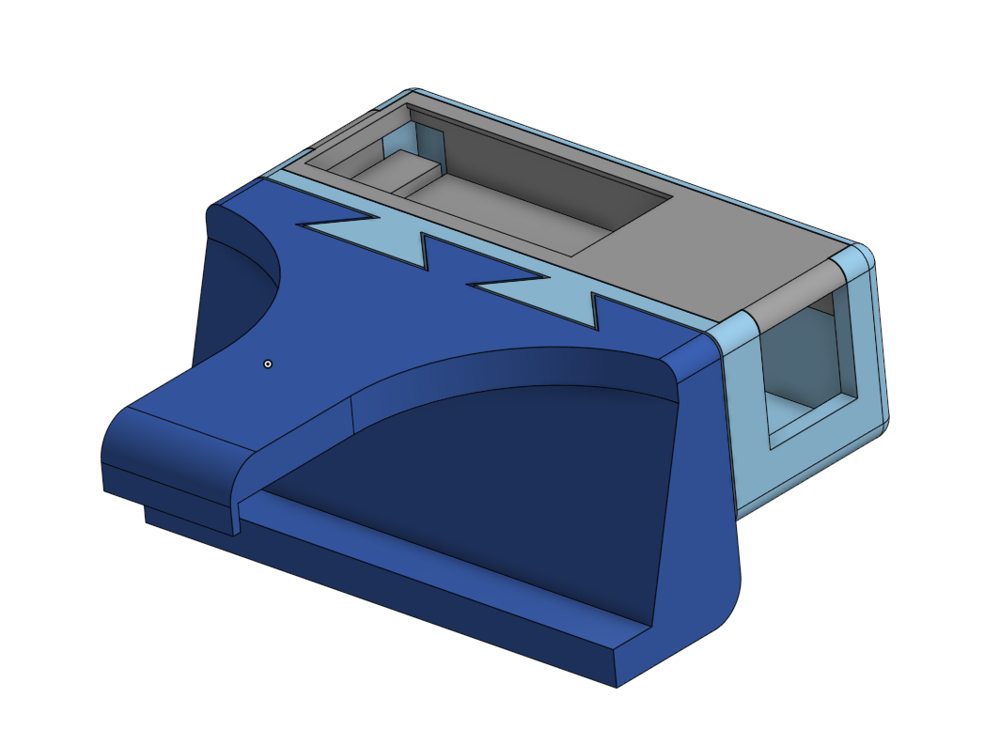

## Build Log
### 5 September 2023
The keyboard was acquired and the idea was born.

Some inspection to see if the board itself still looks good:

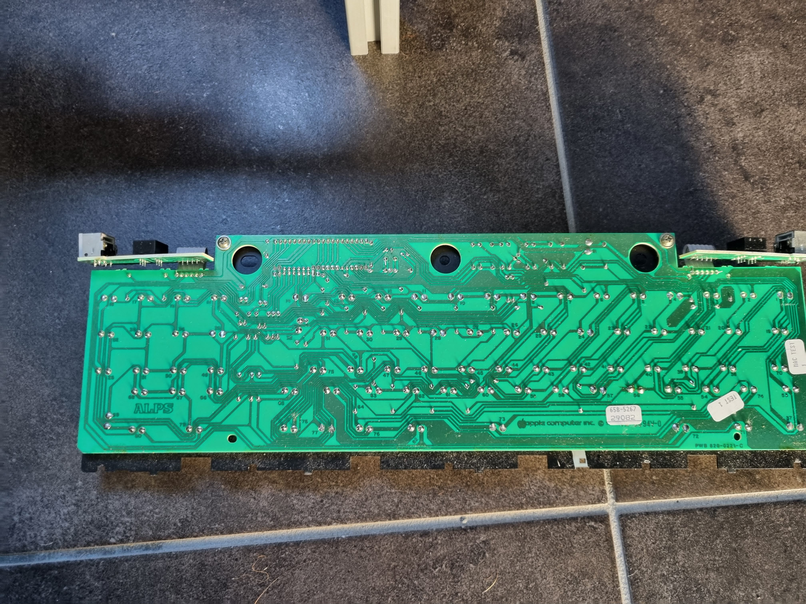

### 11 November 2023
After a small hiatus & many evenings of research and trying out different things, the keyboard finally works.


For now, the converter is held together with wires and tape, but the initial PCB (without OLED) is on it's way.

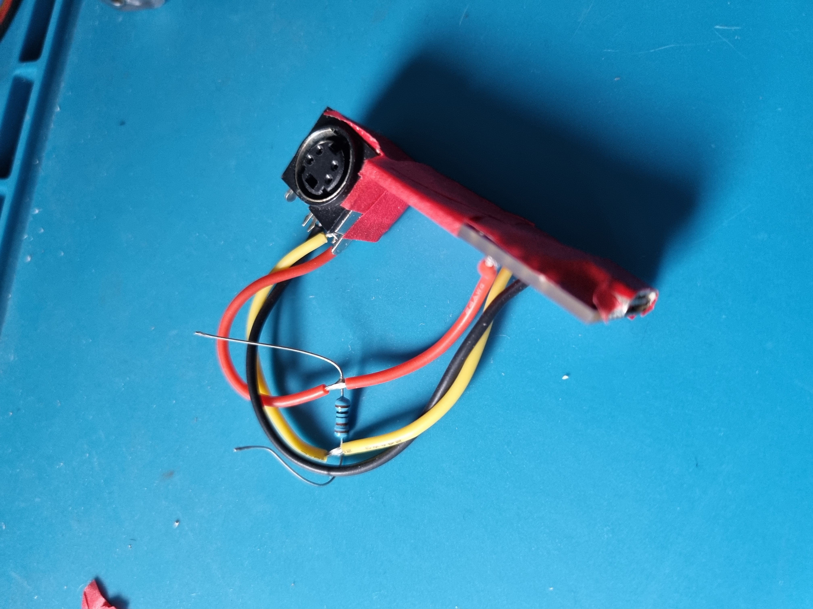

Now the deep cleaning of the keyboard can start (30 years worth of dust and grime isn't going to come off by itself). I can highly recommend [this video](https://www.youtube.com/watch?v=RnvC80Vjuts) for tips on how to clean vintage keyboards. 

I've used lots of Q-tips & isopropyl alcohol for the keyboard itself and a soap bath of a couple days for the keycaps. One of the keycaps on the numpad was sadly severely damaged on the inside (the pin was glued on with hot glue) so I decided to leave it off since I won't use it anyways.

### 4 December 2023
After a long wait, and some problems with delivery, the PCB with the OLED connector is here.

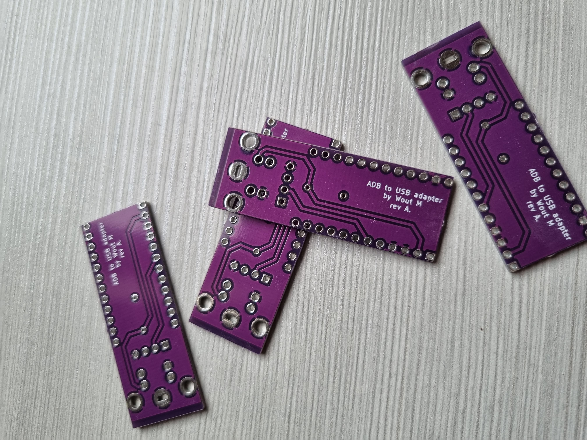

I recommend using some male & female pin headers for the OLED screen. This way you can just slide the screen in the top housing and easily put it on or take it off without worrying about breaking connections.

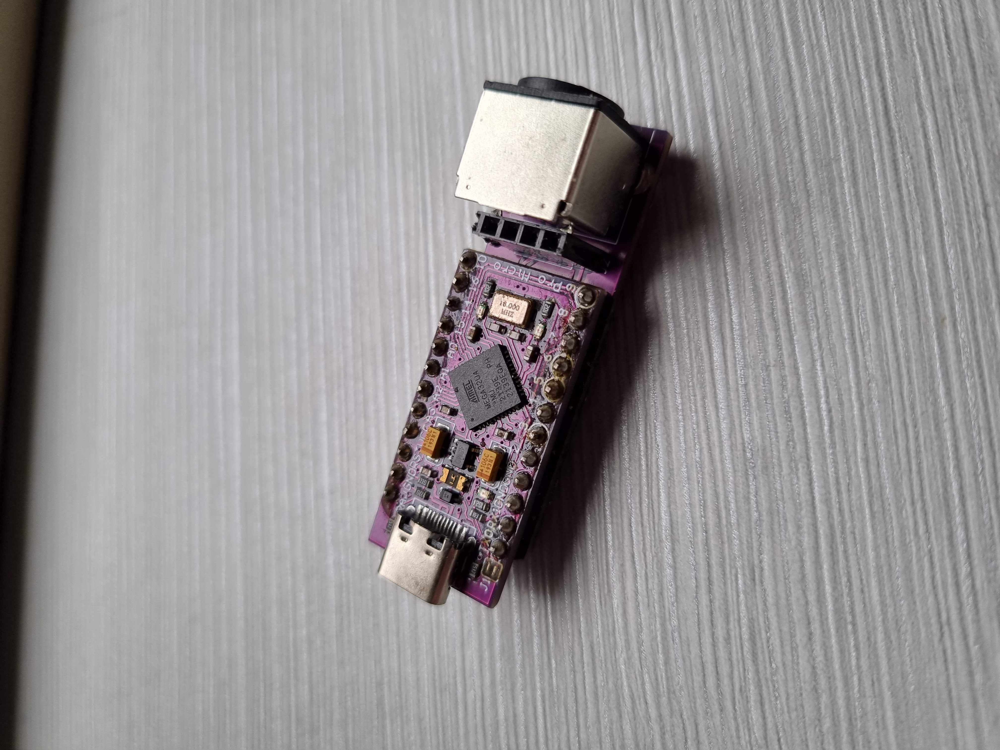
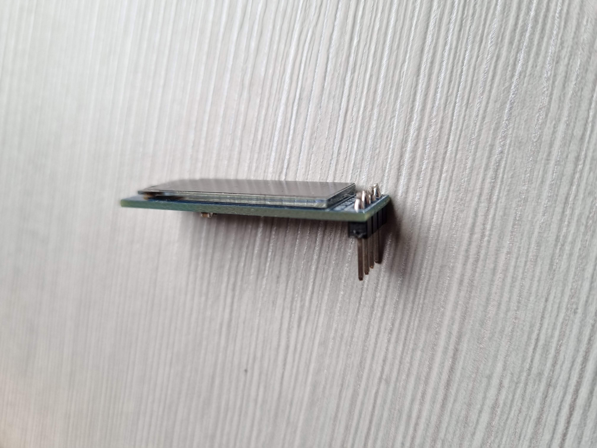

### 8 December 2023
Thanks to my Ender 3 and some evenings on OnShape, the full housing is now finished to and I can actually properly use my keyboard instead of having a taped together wire & bare electronics mess.

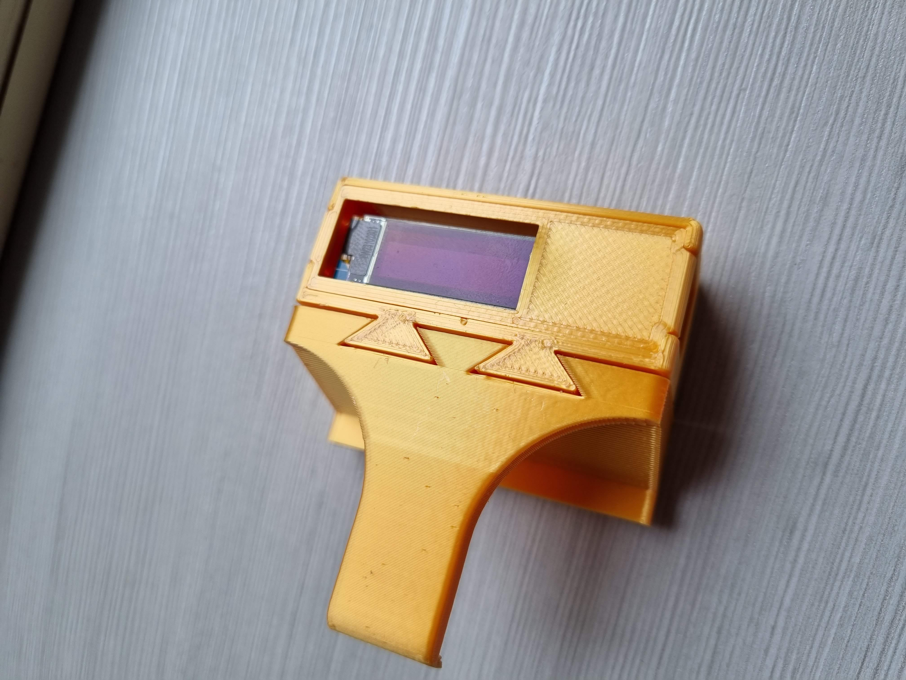
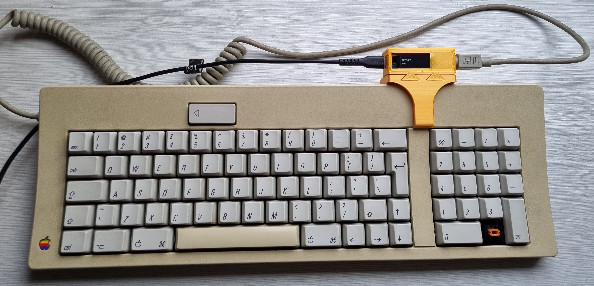

I've been using this keyboard every day at work ever since.